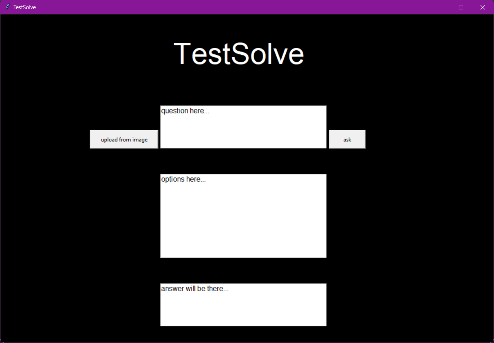
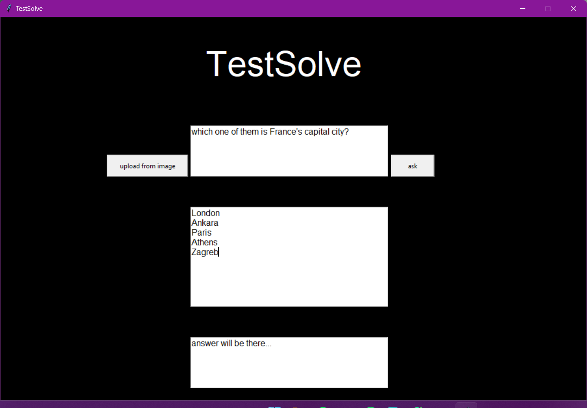
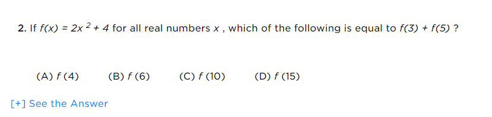
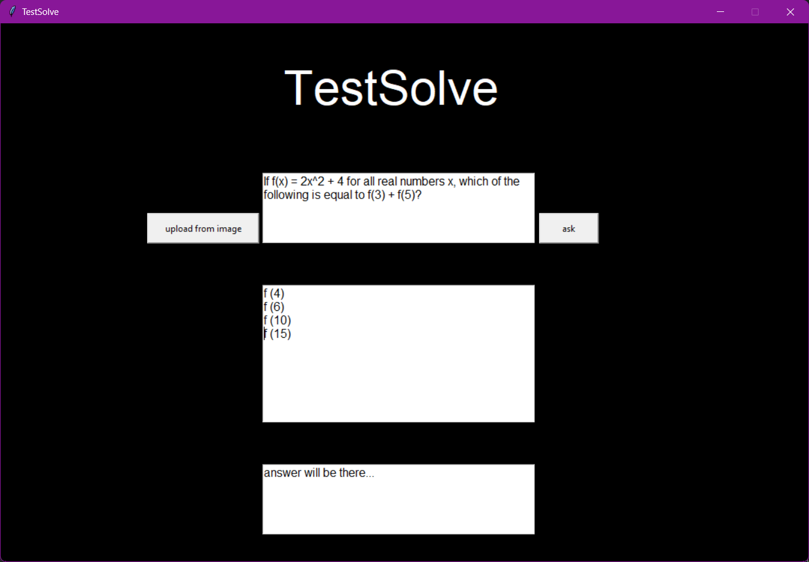

# Welcome to TestSolve Documentation!

TestSolve is a desktop app that is designed to solve all your test questions with the support of **Gemini API**. You can ask your question as text or even in image format! In this documentation, we are going to cover how you can set up and use it.

## Installation

In your CLI, you can run this command line and install the application into your environment.

```shell
gh repo clone iamalreadynoob/testsolver
```

Inside the repo, you will see these files:

* Python files _(main.py, functionality.py, visual.py)_
* Configuration file _(config.json)_
* The list of the required python packages _(requirements.txt)_
* Readme file _(README.md)_

## Configuration

Before running the app, we have to change something inside the configure.json file. In default, configure.json file looks like this:

```json
{
    "api_key": "api_key",
    "theme": "dark",
    "ask_times": 3,
    "model_name": "gemini-1.5-flash"
}
```

To use Gemini API, you have to get an API key from the official Gemini [website](https://ai.google.dev/). After you obtain it, pass it into the json file. Then, we are all set!

* '**theme**' has two valid values: '**light**' and '**dark**'.
* '**ask_times**' declares how many times the question will be solved by Gemini. The most given answer is accepted as true through the algorithm; **the suggested value for repetition is 3**.
* '**model_name**' holds the info that what Gemini model will be used in the app.

## Giving A Text Prompt

TestSolver has basically three parts: question, options and answer boxes.



In the options box, **each line is accepted as another option**. In other words, the **new line character** is used as the separator in this part. Also, at most 10 options are allowed!



After this process, we basically click the asking button and wait for the answer.


## Giving An Image Prompt

TestSolve is capable of working with questions on the images. Let's say we have an [image](https://www.princetonreview.com/college-advice/sat-practice-questions) like this:



We click the image uploading button and select the image file. Then it is getting loaded like this:


Sometimes, the options box can be filled a little bit messy, but we can actually edit it easily.



Then, the rest of the work is clicking the asking button. 